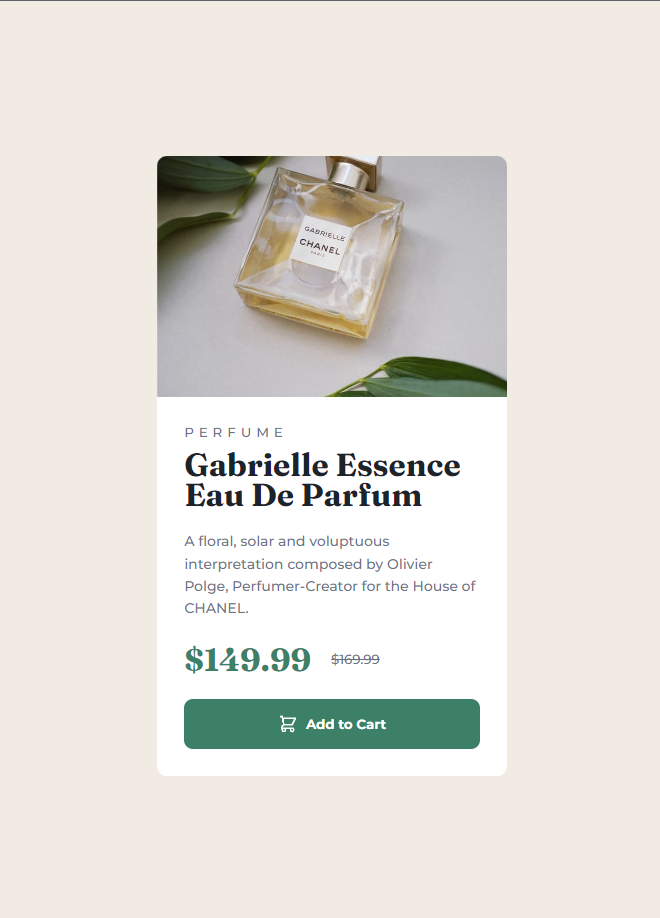
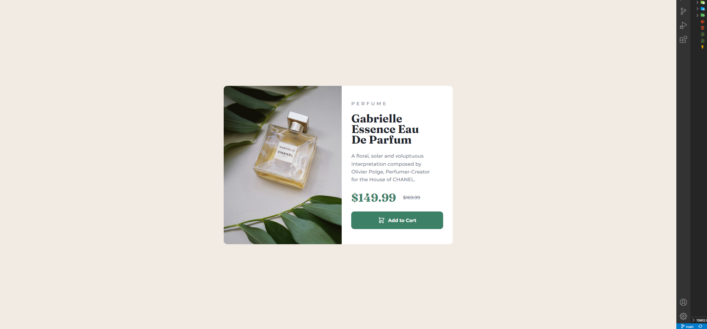

# Frontend Mentor - Product preview card component solution

This is a solution to the [Product preview card component challenge on Frontend Mentor](https://www.frontendmentor.io/challenges/product-preview-card-component-GO7UmttRfa). Frontend Mentor challenges help you improve your coding skills by building realistic projects. 

## Table of contents

- [Overview](#overview)
  - [The challenge](#the-challenge)
  - [Screenshot](#screenshot)
  - [Links](#links)
  - [Built with](#built-with)
  - [Useful resources](#useful-resources)
- [Author](#author)

## Overview

### The challenge

Users should be able to:

- View the optimal layout depending on their device's screen size
- See hover and focus states for interactive elements

### Screenshots

MOBILE 

DESKTOP 

### Links

- Solution URL: [Add solution URL here]
- Live Site URL: [https://reliable-chebakia-dd5d0c.netlify.app]

### Built with

- Semantic HTML5 markup
- Flexbox
- Mobile-first workflow
- [React](https://reactjs.org/) - JS library
- [Vite](https://vitejs.dev/) - Development Environment

### Useful resources
- [Example resource 1]([https://www.example.com](https://itnext.io/responsive-background-images-using-react-hooks-941af365ea1f)) - This helped me for working with media queries in react and background-image properties and i will use it going forward.

## Author
- Frontend Mentor - [@EnderCelik0](https://www.frontendmentor.io/profile/yourusername)
